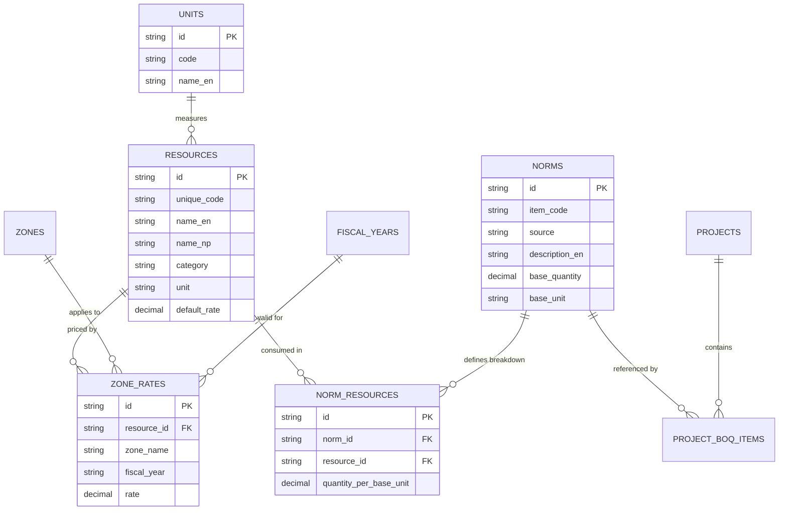

# 07. Entity Relationship (ER) Diagram

```mermaid
erDiagram
    UNITS ||--o{ RESOURCES : "measures"
    RESOURCES ||--o{ ZONE_RATES : "priced by"
    RESOURCES ||--o{ NORM_RESOURCES : "consumed in"
    NORMS ||--o{ NORM_RESOURCES : "defines breakdown"
    NORMS ||--o{ PROJECT_BOQ_ITEMS : "referenced by"
    PROJECTS ||--o{ PROJECT_BOQ_ITEMS : "contains"
    ZONES ||--o{ ZONE_RATES : "applies to"
    FISCAL_YEARS ||--o{ ZONE_RATES : "valid for"

    UNITS {
        string id PK
        string code
        string name_en
    }

    RESOURCES {
        string id PK
        string unique_code
        string name_en
        string name_np
        string category
        string unit
        decimal default_rate
    }

    ZONE_RATES {
        string id PK
        string resource_id FK
        string zone_name
        string fiscal_year
        decimal rate
    }

    NORMS {
        string id PK
        string item_code
        string source
        string description_en
        decimal base_quantity
        string base_unit
    }

    NORM_RESOURCES {
        string id PK
        string norm_id FK
        string resource_id FK
        decimal quantity_per_base_unit
    }
```
